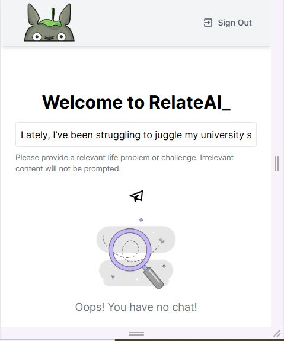

# RelateAI

**RelateAI** is a MERN stack application powered by **Gemini AI**, delivering personalized stories of renowned individuals overcoming similar user challenges. The platform provides users with an inspiring collection of stories from well-known figures who have faced challenges similar to theirs, helping them feel more connected and motivated to overcome their own obstacles.

## Features
- Personalized story recommendations based on user challenges.
- AI-powered suggestions using **Gemini AI**.
- MERN stack implementation for efficient and scalable architecture.

## Screenshots

Below are some screenshots showcasing the application interface and functionality:

| Screenshot 1     | Screenshot 2     | Screenshot 3     |
| ---------------- | ---------------- | ---------------- |
|  |  |  |
| Screenshot 4     | Screenshot 5     | Screenshot 6     |
|  |  |  |
| Screenshot 7     | Screenshot 8     |                  |
|  |  |                  |

## Technologies Used

- **MERN Stack** (MongoDB, Express.js, React, Node.js)
- **Gemini AI** for personalized story recommendations

## Installation

1. Clone the repository:

    ```bash
    git clone https://github.com/MedYessinKhlif/RelateAI.git
    cd RelateAI
    ```

2. Install the dependencies:

    ```bash
    npm install
    ```

3. Set up the environment variables in `.env` file.

4. Run the application:

    ```bash
    npm start
    ```

## License

This project is licensed under the MIT License - see the [LICENSE](LICENSE) file for details.
